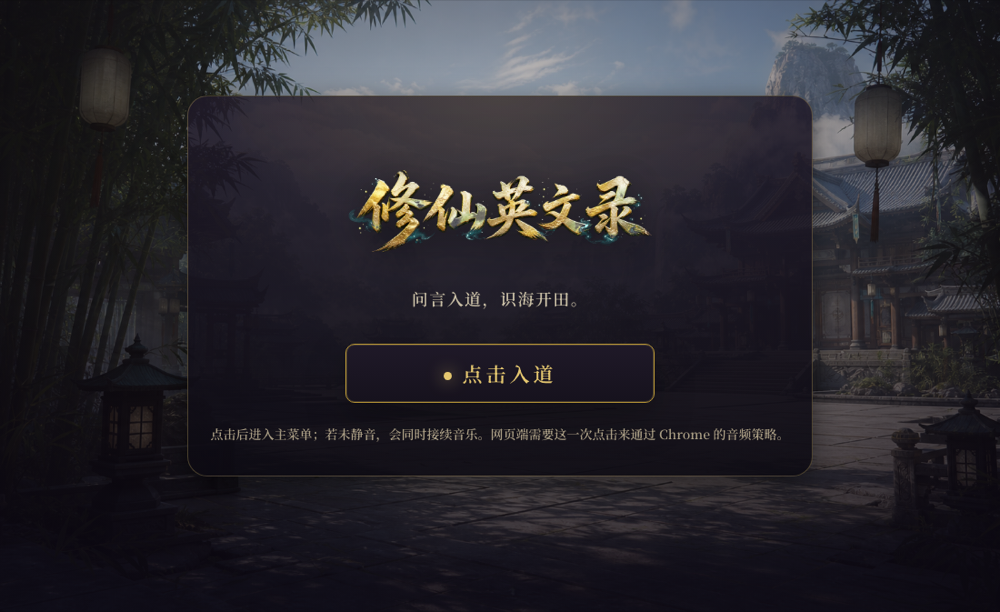
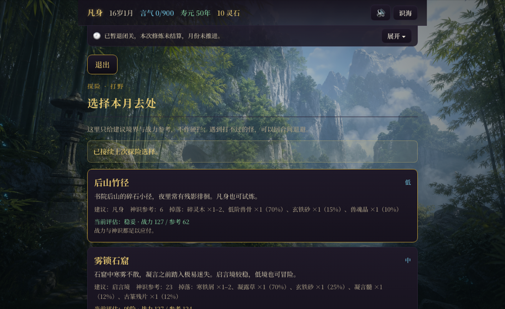
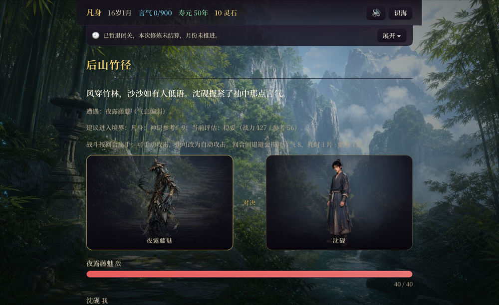

# 世外果缘 · 背单词修仙

**一款把背单词做成修仙故事的英语词汇学习软件。你背下的每一个单词，就是你的修为。**

大多数背单词 App 靠打卡连胜、排行榜和"你已经 3 天没背了"来留住人。世外果缘换了个思路：
**单词是角色变强的唯一来源**。背得多，境界涨得快，剧情走爽路；背得少，照样能玩下去，只是路难走一点。
不逼你，也不锁你。

**▶ [浏览器直接打开](https://wjunlin293-tech.github.io/xiuxian-english/)** —— 免安装、免注册，加载一次后可离线使用。

> 想看另一种玩法？还有一个节奏更快、更热血的 **[《重生之我在仙界学英语》](https://github.com/wjunlin293-tech/xiuxian-english-classic)**，欢迎两版都试试，告诉我更喜欢哪个。

<!-- B站演示视频：发布后把链接填到这里 -->



---

## 适合谁

- **备考中考 / 高考 / 四六级 / 雅思 / 托福 / GRE 的学生**：按考试选词书，词书之间去重，不会反复背同一批词
- **背单词总是坚持不下去的人**：不靠打卡焦虑，靠"想知道后面发生什么"
- **喜欢修仙网文、想顺便把词汇量提上去的人**

## 一眼看懂

| | |
|---|---|
| **词书** | 8 本，去重后共 9,245 词 —— 中考 · 高考 · 四级 · 六级 · 雅思 · 托福 · GRE · 留学 |
| **题型** | 先学 → 再认 → 默写（逐级提示）· 语境题 · 听音辨义 · 听写 |
| **复习节奏** | 参考 SM-2 的间隔复习，按掌握程度间隔 1 / 1 / 2 / 4 / 7 / 15 天，按真实日历计算 |
| **释义** | 取多个常用义项，避免只显示生僻的第一个意思 |
| **发音** | 调用浏览器自带的英语语音朗读，另有音标显示 |
| **词源数据** | 开源词典 [ECDICT](https://github.com/skywind3000/ECDICT)（MIT 协议），按词频筛选、剔除功能词、跨书去重 |
| **运行环境** | 纯 HTML / CSS / JavaScript，无框架、无依赖，电脑浏览器即开即用 |

---

## 学习流程

### 1 · 每个月只能做一件事

游戏里时间按"月"推进，背词、历练、推进剧情都要花一个月。时间有限，背词这件事就显得值钱，
而不是一项任务。寿元、剧情节点的倒计时一直显示在界面上，不背会少什么，你自己看得见，不需要谁来催。


### 2 · 选一本词书

8 本词书覆盖国内考试和出国考试。每本都从 ECDICT 单独生成：按各自难度设词频门槛，去掉 the / of 这类功能词，
再和其他词书去重。比如六级词书已排除全部四级词，GRE 词书已排除四六级词。



### 3 · 先学，再考

新词先看释义、例句、发音，之后系统按你对这个词的熟悉程度派题：从"认得"到"能拼写"，再到"听得出"。
默写答错会逐级给提示（先给首字母、音标等线索，最后才给答案），而不是直接判错了事。

到期的复习按**真实日历**计算。今天连刷两遍不算数，明天回来复习才算。这样系统记录的是你真正记住的，
而不是你刚刚点过的。已经会的词可以直接标熟跳过。


### 4 · 背下的词，就是你的战斗力

战斗强度取决于境界，境界取决于词汇掌握度。上周真正记住的单词，就是这一场打赢的原因，
这也是整套设计里的正反馈。



---

## 设计原则：鼓励，不逼迫

整个开发过程只守一条规则：**背得越多越强，但不背也不会玩不下去。**

- 剧情本身不发放力量，变强只能靠背单词
- 背得少的玩家也能走完故事，只是走更难的路线，剧情会有不同反应
- 失败不会扣除属性或清空进度
- 数值曲线在调整前用脚本模拟过，专门确认"每月只背很少的词"时这条规则依然成立

目标是做一个奖励学习、但不惩罚生活的学习软件。

## 其他系统

学习之外，还有让故事和成长玩得下去的部分：

- 历练探险：多个区域，随机奇遇与材料掉落
- 炼丹与制武：同种丹药重复服用效果递减，不能靠刷材料绕过背词
- 坊市交易、人物关系与好感度、带期限的剧情机缘（错过就没了）
- 多存档、寿元与转世
- 背景音乐与音效由 Web Audio 程序实时合成，不需要音频文件

## 目录结构

```
index.html          入口，跳转到游戏
游戏/                主程序：js/engine（引擎模块）、js/data（词书与剧情）、css、music
素材/                图片素材：场景、人物、装备、道具
docs/screenshots/   README 截图
```

设计文档、词书生成脚本和数值模拟脚本放在另一个私有仓库。

## 当前状态

这是一个 **Demo 版本**，内容和数值还在持续调整。欢迎试玩后在 [Issues](https://github.com/wjunlin293-tech/xiuxian-english/issues) 或 B 站评论区反馈：
哪些词释义不准、哪里卡关、哪里觉得在被逼着背，都很有帮助。

## 致谢与署名

游戏设计、系统设计、剧情与词书筛选：**Junlin (Jeff) Wu**
开发过程中使用了 AI 辅助编程。
词汇数据来自 [ECDICT](https://github.com/skywind3000/ECDICT)（MIT License）。

---

<details>
<summary><b>English summary</b></summary>

**世外果缘 (Shiwai Guoyuan)** is a Chinese-language English-vocabulary learning app that replaces streak-based
motivation with narrative: the words you learn and review are the *only* source of your character's power
in a xianxia (cultivation) story. Study more and the story opens up; study less and you take a harder path,
but you are never locked out.

- 8 word books, 9,245 distinct words (Zhongkao, Gaokao, CET-4, CET-6, IELTS, TOEFL, GRE, study-abroad), generated from ECDICT (MIT) with frequency filtering and cross-book de-duplication
- Question types: learn, recognise, spell (with graded hints), context, listening, dictation
- Spaced review inspired by SM-2, with 1/1/2/4/7/15-day intervals on real calendar time
- Plain HTML/CSS/JS, no dependencies. [Play in the browser](https://wjunlin293-tech.github.io/xiuxian-english/)

</details>
